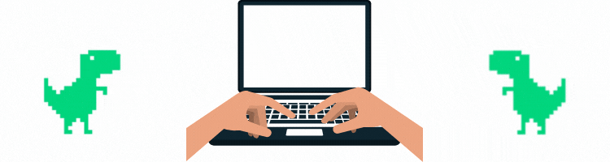

  

 

    
    &nbsp;&nbsp;&nbsp;&nbsp;&nbsp;&nbsp;&nbsp;&nbsp;&nbsp;
    
    &nbsp;&nbsp;&nbsp;&nbsp;&nbsp;&nbsp;&nbsp;&nbsp;&nbsp;
    
    &nbsp;&nbsp;&nbsp;&nbsp;&nbsp;&nbsp;&nbsp;&nbsp;&nbsp;
    

 

<h2 align="center">✔️ My Stats ✔️</h2>

  
  

  
   
  
  

  
<h2 align="center"> Hi, my name is Helder! ✌️</h2>
<h3 align="left">🤓 More about me! 🤓</h3>
  

  
  
 - 👨‍🎓 Computer Engineering Student at UFSC - Currently in the sixth phase, graduation in 2024.2 

  
 - 🎯 Interests: Python, C, C++, Hardware Development, Cybersecurity. 

  
 - 🥅 Goal: To create a more just and hopeful world for the people who really need it. 

  
 - ❤️ Hobbies: Games, poems and martial arts. 

 

<h2 align="center"> 📈 Skills! ✌️</h2>

    
    &nbsp;&nbsp;&nbsp;&nbsp;&nbsp;&nbsp;&nbsp;&nbsp;&nbsp;&nbsp;&nbsp;&nbsp;&nbsp;
      
    &nbsp;&nbsp;&nbsp;&nbsp;&nbsp;&nbsp;&nbsp;&nbsp;&nbsp;&nbsp;&nbsp;&nbsp;&nbsp;
    
    &nbsp;&nbsp;&nbsp;&nbsp;&nbsp;&nbsp;&nbsp;&nbsp;&nbsp;&nbsp;&nbsp;&nbsp;&nbsp;
    
  

